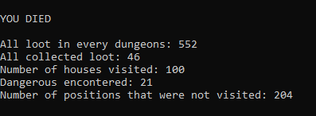

# Labirinto Recorrente: Explorando a Dungeon

    
 
 
</a> 

 

 

A atividade se trata de se ler um número <i>n</i> de matrizes, todas quadráticas, de um arquivo, que serão os labirintos do nosso <i>jogo</i>. Temos um <i>player</i> perdido nesses labirintos. Dessa forma, <i>player</i> deve andar pelos labirintos para tentar escapar, ou acabar morrendo. As matrizes são compostas por 3 caracteres diferentes, sendo eles:

|          Caractere            | Função                                                                                            |
| ------------------------------| ------------------------------------------------------------------------------------------------- |
|  `#`                          | Parede, o <i>player</i> não pode andar para as posições com esse caractere.                       |
|  `*`                          | Perigo, quando adentrar a uma casa com esse caractere, o player perderá uma vida.                 |
|  `Números de 1 a 9`           | São os tesouros existentes nessas casas. Sempre que o player cair em alguma casa numerada, ele pega um tesouro, que é subtraido do valor total na casa até 0, e somado em seu inventário. Quando o valor chega a zero, se torna uma casa vazia, onde o <i>player</i> simplesmente irá passar por ela.             |

O <i>player</i> inicia a exploração com um valor fixo de 10 vidas. A cada 4 itens coletados das casas numeradas, ele receberá uma vida adicional, sempre podendo sobrepor o valor máximo de 10. Se sua vida chegar a 0, ele irá morrer e o programa terminará. 

Ao final, o programa deve retornar:

|                        |                                                                                                   |
| -----------------------| ------------------------------------------------------------------------------------------------- |
|  `A`                   | quantas casas foram percorridas ao todo;                                                          |
|  `B`                   | qual a soma de itens consumidos pelo caminho;                                                     |
|  `C`                   | quantas casas da matriz ficaram sem serem exploradas;                                             |
|  `D`                   | quantos perigos foram enfrentados ao decorrer do percurso.                                        |

Tendo em vista que, as posições que o <i>player</i> irá caminhar serão geradas sempre aleatoriamente e, o mesmo tem a possibilidade de caminhar entre as matrizes sendo então, labirintos ligados. O objetivo em si, não é que ele consiga vencer e escapar e sim que ele colete o máximo de itens possíveis e acabe morrendo. 

 

 

# Arquivos e Funções

O código é dividido em 5 arquivos, sendo eles:

|  Arquivo                        |   Função                                                                                          |
| ------------------------------- | ------------------------------------------------------------------------------------------------- |
|  `main.cpp`                     | Arquivo principal para chamar as funções.                                                         |
|  `matrix.hpp`                   | Define as funções para tratamento das matrizes e arquivos.                                        |
|  `matrix.cpp`                   | Formatação das funções declaradas no arquivo matrix.hpp.                                          |
|  `player.hpp`                   | Define a função de locomoção do "player".                                                         |
|  `player.cpp`                   | Formatação da função declarada no arquivo player.hpp, tendo somente a função <i>Explore</i>       |

|  Função                                                       |  Funcionalidade                                                                                                                         |
| ------------------------------------------------------------- | --------------------------------------------------------------------------------------------------------------------------------------- |
|  `Show` - [`matrix.cpp`, linhas 3 a 16]                       | Imprimir matriz;                                                                                                                        |
|  `Read` - [`matrix.cpp`, linhas 18 a 86]                      |  Realiza a leitura do arquivo primordial;                                                                                               |
|  `Maps` - [`matrix.cpp`, linhas 88 a 114]                     |  Salva as matrizes separadamente em novos arquivos;                                                                                     |
|  `AllLoot` - [`matrix.cpp`, linhas 116 a 128]                 |  Utilizada para se ter o valor total de itens de todo o labirinto                                                                       |
|  `GetMap` - [`matrix.cpp`, linhas 130 a 166]                  |  Lê os novos arquivos criados com as matrizes individuais e retorna como uma matriz do tipo <i>String</i>                               |
|  `SaveMap` - [`matrix.cpp`, linhas 168 a 194]                 | Sobreescreve o arquivo com a matriz individual para salvar as alterações                                                                |
|  `Remove` - [`matrix.cpp`, linhas 196 a 212]                  |  Remove todos os novos arquivos criados                                                                                                 |
|  `ReadCompareMatrix` - [`matrix.cpp`, linhas 214 a 281]       |  Realiza a leitura dos arquivos alterados.                                                                                              |
|  `CompareMatrix` - [`matrix.cpp`, linhas 284 a 302]           |  Compara as matrizes do arquivo original com as matrizes individuais alteradas e retorna o valor de posições que não foram passadas.                                                                                                                                                                                                 |
|  `SaveOutput` - [`matrix.cpp`, linhas 304 a 340]              | Função parasalvar as matrizes alteradas todas em um novo arquivo chamado de Output.data;                                                                                  |
|  `Explore` - [`player.cpp`]                                   | Função de movimentação e ações gerais do <i>Player</i>                                                                                  |

 

 

# Lógica Implementada

A lógica utilizada para a implementação do código foi de primeiro dividir as matrizes do arquivo principal <i>input.data</i> em um arquivo diferente. Tendo cada matriz separada em um novo arquivo para facilitar a manipulaçao. Utilizando a função <i>Read</i> para ler o arquivo principal, lendo uma matriz de cada vez e armazenando-as em um novo arquivo através da função <i>Maps</i>. Ainda dentro da função <i>Read</i> é utilizada a função <i>AllLoot</i> para se ter um controle do valor total de itens em todo o labirinto. 

Em seguida, é chamada a função <i>Explore</i>. Nela, é onde nosso <i>player</i> irá começar a se locomover. Inicialmente, a partir da função <i>GetMap</i>, que sempre irá retornar uma matriz do tipo <i>String</i>, lemos o arquivo passando seu nome como parâmetro e alocamos na matriz que será retornada. Em seguida, é gerado aleatóriamente a posição inicial do <i>player</i>, sendo utilizado um loop para caso a primeira casa seja uma parede(<i>#</i>), ele irá continuar a gerar uma posição aleatoriamente, até que não seja uma parede.  

Então é gerado um número aleatório de 0 a 7 para decidir para onde ele irá caminhar:

|  Nº gerado aleatoriamente       |  Posição que ele irá caminhar                                                                    |
| ------------------------------- | ------------------------------------------------------------------------------------------------- |
|  `0`                            | Direita (Leste);                                                                                  |
|  `1`                            | Esquerda (Oeste);                                                                                 |
|  `2`                            | Cima (Norte);                                                                                     |
|  `3`                            | Baixo (Sul)                                                                                       |
|  `4`                            | Diagonal de Cima a Direita (Nordeste)                                                             |
|  `5`                            | Diagonal de Cima a Esquerda (Noroeste)                                                            |
|  `6`                            | Diagonal de Baixo a Direita (Sudeste)                                                             |
|  `7`                            | Diagonal de Baixo a Esquerda (Sudoeste)                                                           |       

As condições são quase as mesmas para todos os casos. Sempre priorizando o fato da possibilidade do <i>teleporte</i> para uma próxima matriz. Ele poderá sempre partir de uma Matriz para a outra, seja pra frente ou para trás. Caso ele esteja na última matriz e caminhe para a matriz da frente, ele retorna a primeira matriz, caso esteja na primeira e caminhe para a matriz de "trás", ele irá diretamente para a última Matriz, formando assim uma ligação circular entre as matrizes.

O <i>teleporte</i> funciona da seguinte maneira: sempre que ele se encontra na última coluna e caminhar para o Leste(0), Nordeste(4) ou Sudeste(6) , ele partira para a próxima matriz da frente. Sempre que ele estiver na primeira linha e caminhar para o Norte(2), Nordeste(4) ou Noroeste(5) ele também partirá para frente, nesse caso, o Noroeste(5) tem um caso especial, em que, caso a coluna seja a primeira também, ele caminhará para a Matriz de trás e não para a da frente. 

Caso ele esteja na primeira coluna e ele caminha para o Oeste(1), Sudeste(6) ou Sudoeste(7) ele irá para a matriz anterior. Se ele se encontrar na última linha e caminhar para o Sul(3), Sudeste(6) ou Sudoeste(7) ele também irá para a matriz anterior, nesse caso, Sudeste(6) também há um caso especial em que, caso ele esteja também na ultima coluna, ele irá para a matriz da frente e não para a de trás. 

Sempre que se cai em alguma das condições de mudança de mapa, se chama as funções <i>SaveMap</i> para salvar as alterações e <i>GetMap</i> para carregar a próxima matriz. 

As demais condições são relacionadas aos caracteres presentes na matriz, no caso de ser "<i>#</i>" ele não poderá andar, "<i>*</i>" ele perderá uma vida e o caractere será alterado para "<i>!</i>" para se ter o controle de que já se passou por essa casa, mas, mesmo sendo alterado, caso ele caia novamente numa casa com "<i>!</i>" ele continuará perdendo uma vida. E as casas numeradas em que se é subtraido o valor da casa, e somado em seu inventário. 

A condição de vitória se trata algo quase impossível de se acontecer. O <i>player</i> deve andar por todas as matrizes somente em posições com "<i>0</i>", "<i>*</i>" ou "<i>!</i>", e retornar ainda com vida a posição inicial na primeira matriz. 

Exemplo de como se deve aparecer na tela: 

Por fim, os arquivos com as matrizes alteradas são todas salvas em apenas um arquivo chamado "<i>output.data</i>", e os arquivos independentes são removidos.

 

 

# Conclusão

Visto que se foi possível retornar na tela tudo que se pediu. Só resta o custo computacional.

Como o programa é baseado com a movimentação do <i>player<i> de forma totalmente aleatória, só é possível estipular suposições sobre o custo do algoritimo.

|                        |                                                                                                   |
| -----------------------| ------------------------------------------------------------------------------------------------- |
|  `1`                   | Caso o personagem ande em todas as casas possíveis, o custo será quadrático;                      |
|  `2`                   | O custo será próximo do linear caso ele consiga se manter em uma constante linha reta;            |

Dessa forma, visto que no melhor dos casos ele pode ter um custo linear, o algoritimo se encontra sim como uma das melhores formas de execução. Obviamente aberto a melhorias, mas ja se classificando como um O(n²).

 

 

# Especificações do Dispositivo utilizado

|                                                                                                                            |
| -------------------------------------------------------------------------------------------------------------------------- |
|  `Processador`         -> Intel(R) Core(TM) i7-8565U CPU @ 1.80GHz   1.99 GHz                                              |
|  `RAM Instalada`       -> 16.0 GB (utilizável: 15.8 GB)                                                                    |
|  `Tipo de Sistema`     -> Sistema operacional de 64 bits, processador baseado em x64                                       |
|  `Sistema Operacional` -> Edição Windows 10 Home Single Language, versão 21H2                                              |

 

 

# Compilação e Execução

Esse pequeno exemplo possui um arquivo Makefile que realiza todo o procedimento de compilação e execução. Para tanto, temos as seguintes diretrizes de execução:

| Comando                |  Função                                                                                           |
| -----------------------| ------------------------------------------------------------------------------------------------- |
|  `make clean`          | Apaga a última compilação realizada contida na pasta build                                        |
|  `make`                | Executa a compilação do programa utilizando o gcc, e o resultado vai para a pasta build           |
|  `make run`            | Executa o programa da pasta build após a realização da compilação                                 |

 

 

# Contatos

 

<a style="color:black" href="mailto:jmarconiadm@outlook.com?subject=[GitHub]%20Source%20Dynamic%20Lists">
✉️ <i>jmarconiadm@outlook.com</i>
</a>